Expected Goals model
================
Twitter: @KubaMichalczyk

Since I started to follow the football analytics community, Expected Goals has been popping up everywhere. However, methodology is rarely described, not to mention the whole process of modelling. Therefore I just decided to document my work and publish it, so that:

-   when I'll post some remark/graph with xG calculated you could easily check how it's calculated and judge for yourself if it has any value
-   those who have access to @Stratabet data could just take it from there and possibly improve it.

Data contains recorded chances from 5 biggest European leagues (German Bundesliga, Spanish Primera Division, English Premier League, Italian Serie A and French League 1) during whole 2016/2017 season and a part of current season (until 19/02/2017).

Data preparation
----------------

``` r
library(tidyverse)
library(lubridate)
library(magick)

source('strata_pitch_plot.R')
```

Firstly, we import the data. While importing data I set the time parser as character as the default guessing interprets this variable as time type (which means time of a day) and fails to read all the values greater than 24:00. I also set the parser to all location variables as it'll be helpful to plot some observations directly on the pitch while tidying data.

``` r
chances_PL_16_17 <- read_csv('chances_EngPL_2016_2017.csv', 
                             col_types = cols(time = col_character(),
                                              location_x = col_double(),
                                              location_y = col_double(),
                                              primaryLocation_x = col_double(),
                                              primaryLocation_y = col_double()))
chances_L1_16_17 <- read_csv('chances_FraL1_2016_2017.csv',
                             col_types = cols(time = col_character(),
                                              location_x = col_double(),
                                              location_y = col_double(),
                                              primaryLocation_x = col_double(),
                                              primaryLocation_y = col_double()))
chances_BL_16_17 <- read_csv('chances_GerBL_2016_2017.csv', 
                             col_types = cols(time = col_character(),
                                              location_x = col_double(),
                                              location_y = col_double(),
                                              primaryLocation_x = col_double(),
                                              primaryLocation_y = col_double()))
chances_SA_16_17 <- read_csv('chances_ItaSA_2016_2017.csv', 
                             col_types = cols(time = col_character(),
                                              location_x = col_double(),
                                              location_y = col_double(),
                                              primaryLocation_x = col_double(),
                                              primaryLocation_y = col_double()))
chances_PD_16_17 <- read_csv('chances_SpaPD_2016_2017.csv', 
                             col_types = cols(time = col_character(),
                                              location_x = col_double(),
                                              location_y = col_double(),
                                              primaryLocation_x = col_double(),
                                              primaryLocation_y = col_double()))
chances_PL_17_18 <- read_csv('chances_EngPL_from_2017-07-01.csv', 
                             col_types = cols(time = col_character(),
                                              location_x = col_double(),
                                              location_y = col_double(),
                                              primaryLocation_x = col_double(),
                                              primaryLocation_y = col_double()))
chances_L1_17_18 <- read_csv('chances_FraL1_from_2017-07-01.csv', 
                             col_types = cols(time = col_character(),
                                              location_x = col_double(),
                                              location_y = col_double(),
                                              primaryLocation_x = col_double(),
                                              primaryLocation_y = col_double()))
chances_BL_17_18 <- read_csv('chances_GerBL_from_2017-07-01.csv', 
                             col_types = cols(time = col_character(),
                                              location_x = col_double(),
                                              location_y = col_double(),
                                              primaryLocation_x = col_double(),
                                              primaryLocation_y = col_double()))
chances_SA_17_18 <- read_csv('chances_ItaSA_from_2017-07-01.csv', 
                             col_types = cols(time = col_character(),
                                              location_x = col_double(),
                                              location_y = col_double(),
                                              primaryLocation_x = col_double(),
                                              primaryLocation_y = col_double()))
chances_PD_17_18 <- read_csv('chances_SpaPD_from_2017-07-01.csv', 
                             col_types = cols(time = col_character(),
                                              location_x = col_double(),
                                              location_y = col_double(),
                                              primaryLocation_x = col_double(),
                                              primaryLocation_y = col_double()))
                           
chances_all <- bind_rows(chances_BL_16_17, chances_L1_16_17, chances_PD_16_17, chances_PL_16_17, 
                         chances_SA_16_17, chances_BL_17_18, chances_L1_17_18, chances_PD_17_18,
                         chances_PL_17_18, chances_SA_17_18)
chances_all <- chances_all %>% rename(id = X1)
```

``` r
chances_all %>% glimpse()
```

    ## Observations: 65,769
    ## Variables: 27
    ## $ id                <int> 88, 92, 91, 90, 89, 87, 86, 914, 901, 902, 9...
    ## $ competition       <chr> "GerBL1", "GerBL1", "GerBL1", "GerBL1", "Ger...
    ## $ gsm_id            <int> 2255206, 2255204, 2255204, 2255209, 2255209,...
    ## $ kickoffDate       <date> 2017-05-20, 2017-05-20, 2017-05-20, 2017-05...
    ## $ kickoffTime       <time> 13:30:00, 13:30:00, 13:30:00, 13:30:00, 13:...
    ## $ hometeam_team1    <chr> "Hertha BSC", "Borussia Dortmund", "Borussia...
    ## $ awayteam_team2    <chr> "Bayer Leverkusen", "Werder Bremen", "Werder...
    ## $ icon              <chr> "penawarded", "penawarded", "penawarded", "p...
    ## $ chanceRating      <chr> "Good", "Poor", "Good", "Very Good", "Great"...
    ## $ team              <chr> "Hertha BSC", "Borussia Dortmund", "Borussia...
    ## $ type              <chr> "Holding", "Tackle", "Tackle", "Holding", "H...
    ## $ time              <chr> "84:05", "73:50", "87:25", "39:26", "62:18",...
    ## $ player            <chr> "-", "-", "-", "-", "-", "-", "-", "D. Blum"...
    ## $ location_x        <dbl> NA, NA, NA, NA, NA, NA, NA, 53, 14, 0, 0, 0,...
    ## $ location_y        <dbl> NA, NA, NA, NA, NA, NA, NA, 23, 34, 44, 44, ...
    ## $ bodyPart          <chr> "-", "-", "-", "-", "-", "-", "-", "Left", "...
    ## $ shotQuality       <chr> "N/A", "N/A", "N/A", "N/A", "N/A", "N/A", "N...
    ## $ defPressure       <chr> "-", "-", "-", "-", "-", "-", "-", "1", "1",...
    ## $ numDefPlayers     <chr> "-", "-", "-", "-", "-", "-", "-", "1", "2",...
    ## $ numAttPlayers     <chr> "-", "-", "-", "-", "-", "-", "-", "0", "1",...
    ## $ outcome           <chr> "Penalty Awarded", "Penalty Awarded", "Penal...
    ## $ primaryPlayer     <chr> "-", "-", "-", "-", "-", "-", "-", "B. Oczip...
    ## $ primaryType       <chr> "-", "-", "-", "-", "-", "-", "-", "Open Pla...
    ## $ primaryLocation_x <dbl> NA, NA, NA, NA, NA, NA, NA, 124, 50, NA, -7,...
    ## $ primaryLocation_y <dbl> NA, NA, NA, NA, NA, NA, NA, 41, 3, NA, 114, ...
    ## $ secondaryPlayer   <chr> "-", "-", "-", "-", "-", "-", "-", "D. Blum"...
    ## $ secondaryType     <chr> "-", "-", "-", "-", "-", "-", "-", "Open Pla...

Most of variables were parsed as character, but let's keep them this way for now (I will parse them into appropriate type (ex. factor or double) just before modelling part).

Firstly, let's check ID's uniqueness.

``` r
chances_all %>% group_by(id) %>% filter(n() > 1) %>% count()
```

    ## # A tibble: 11,321 x 2
    ## # Groups:   id [11,321]
    ##       id     n
    ##    <int> <int>
    ##  1    23     2
    ##  2    33     2
    ##  3    44     2
    ##  4    54     2
    ##  5    56     2
    ##  6    58     2
    ##  7    61     3
    ##  8    62     2
    ##  9    65     3
    ## 10    72     2
    ## # ... with 11,311 more rows

There are some duplicated IDs, so let's give our own IDs based on time of event.

``` r
chances_all <- chances_all %>% 
  arrange(kickoffDate, kickoffTime, as.numeric(ms(time))) %>%
  mutate(old_id = id, id = row_number())
```

Note: This is not accurately sorted by time of event, but it will do.

Next, we exclude penalties from the data set. Due to their specificity another model could be build to capture penalties.

``` r
chances <- chances_all %>% filter(!icon == 'penawarded')
penalties <- chances %>% filter(str_detect(type, 'Penalty') | icon == 'penmissed')
chances <- chances %>% filter(!id %in% penalties$id)
```

Now we will check a data coherence.

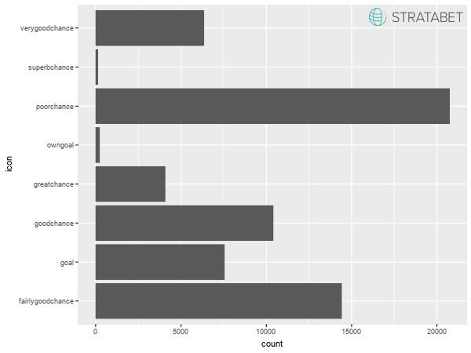

We don't want to model own goal; we are excluding them from our data set.

``` r
chances <- chances %>% filter(!icon == 'owngoal')
```

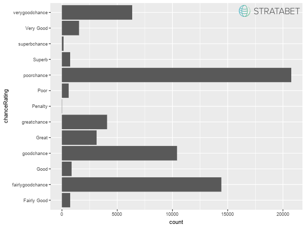

There are still some penalties...

``` r
penalties2 <- chances %>% filter(chanceRating == 'Penalty')
penalties <- bind_rows(penalties, penalties2)
chances <- chances %>% filter(!id %in% penalties2$id)
```

...and some inconcistencies in inputted values - let's fix them as well.

``` r
plt <- image_graph(width = 600, height = 450, res = 72)
chances %>% ggplot() + geom_bar(aes(type)) + coord_flip()
invisible(dev.off())
plt %>% image_composite(logo, offset = "+470+385")
```

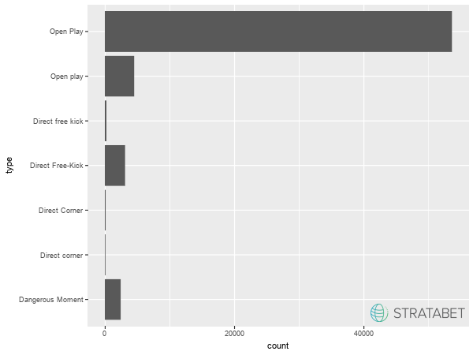

Let's unify the inputs (ex. 'Direct Free-Kick' and 'Direct Free kick').

``` r
chances <- chances %>%
  mutate(type = case_when(
    str_detect(type, 'Open [Pp]lay') ~ 'Open Play',
    str_detect(type, 'Direct [Ff]ree[- ][Kk]ick') ~ 'Direct Free-Kick',
    TRUE ~ type))
```

According to Stratagem definitions a direct shot from corner is marked as Direct Free-kick. So we should investigate which of these should be remarked as Direct Free-kick and which of these are just `primaryType` - we can do so based on (x, y) coordinates.

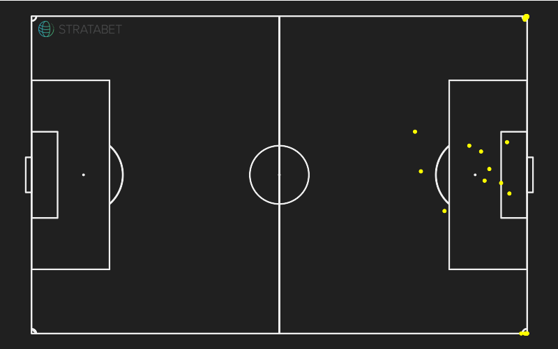

``` r
temp2 <- temp %>% filter((location_x < -130 & bodyPart == 'Left') | 
                  (location_x > 130 & bodyPart == 'Right')) 
```

    ## # A tibble: 1 x 1
    ##       n
    ##   <int>
    ## 1    20

We can observe that 20 chances which are Corner kicks (based on location) are in-swingers (corners swerving towards the goal) based on x coordinate and foot used So these could be actually direct attempt with Khazri, Callejon and Pulgar unique goals among them.

``` r
chances <- chances %>% 
  mutate(type = ifelse(id %in% temp2$id, 'Direct Free-Kick', type))
```


The remaining 10 observations are just shots after corner-kick, so we should probably change a `type` to 'Open Play' and `primaryType` to 'Corner'.

``` r
chances <- chances %>% 
  mutate(type = ifelse(id %in% temp$id,'Open Play', type),
         primaryType = ifelse(id %in% temp$id, 'Corner', primaryType))
```

Ok, so we are left with 3 categories. But let's keep in mind that Dangerous Moment is by definition the moment when there was an opportunity to shoot, but a shot wasn't taken. Since there couldn't be a goal in these situations, we should probably exclude these observations from our training set and include them in the test set only.

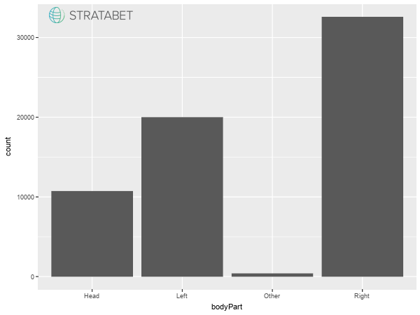

We can observe that shots with right foot were taken over 1.5 times more than with left foot. This is certainly not surprising as left footed players are a definite minority and beyond any doubt you usually prefer to shoot with your stronger foot. But, as we do not have an infomation if the player is right or left footed, I don't think it's a good idea to differentiate. As an information if player takes the shot with his stronger or weaker foot seems to be crucial it would be a good idea to look for some dataset (could be for ex. from transfermarkt or FIFA game series) with information if player is left/right footed and match the datasets together. This makes a room for improvement in future, but as for now we just create a one level for both feets.

``` r
chances <- chances %>%
  mutate(bodyPart = ifelse(bodyPart %in% c('Left', 'Right'), 'Foot', bodyPart))
```

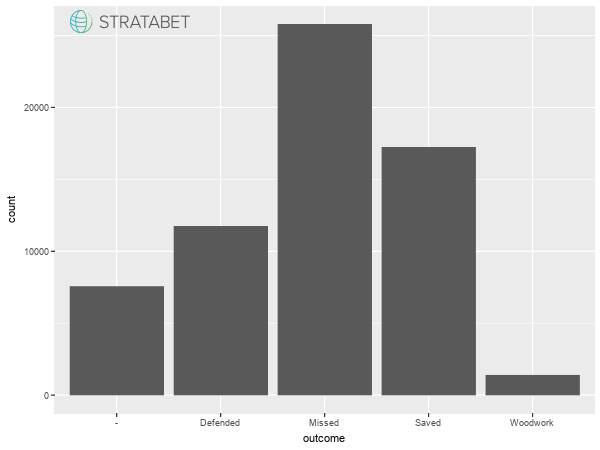

Nothing baffling here.

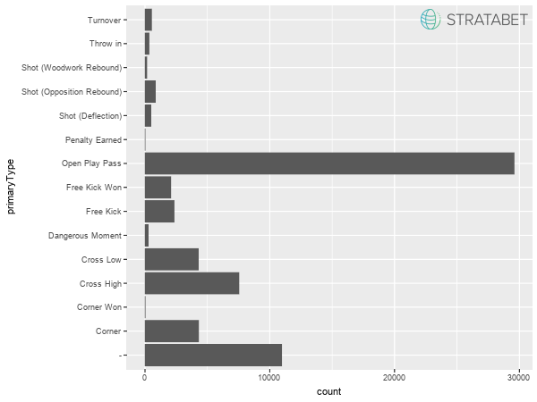

We were supposed to exclude all penalties, but there are some assists marked as 'Penalty Earned'. So let's take a closer look.

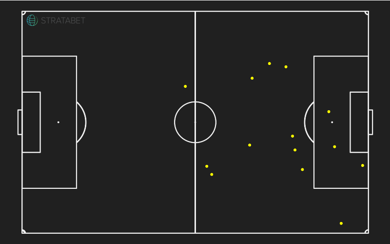

In 11 out of 14 cases this can't be Penalty Earned as the location is outside penalty area. These chances don't look like as penalties taken as well (location again). As it's hard to figure out what should be a correct value of `primaryType` in these cases I'll just replace them with `NA`.

``` r
chances <- chances %>% mutate(primaryType = ifelse(primaryType == 'Penalty Earned',
                                                   NA, primaryType))
```

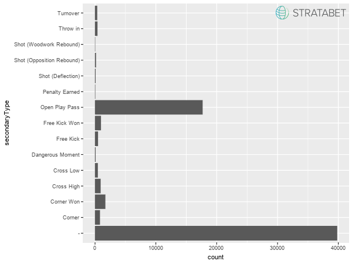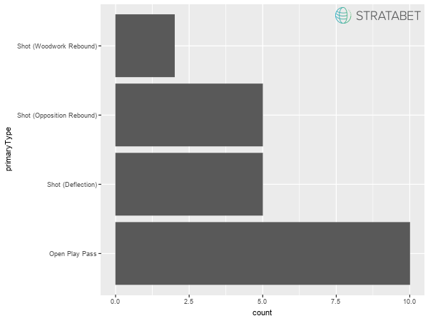

These chances looks like deflected penalties, but since after deflection we have 'Open Play' chance let's keep it.

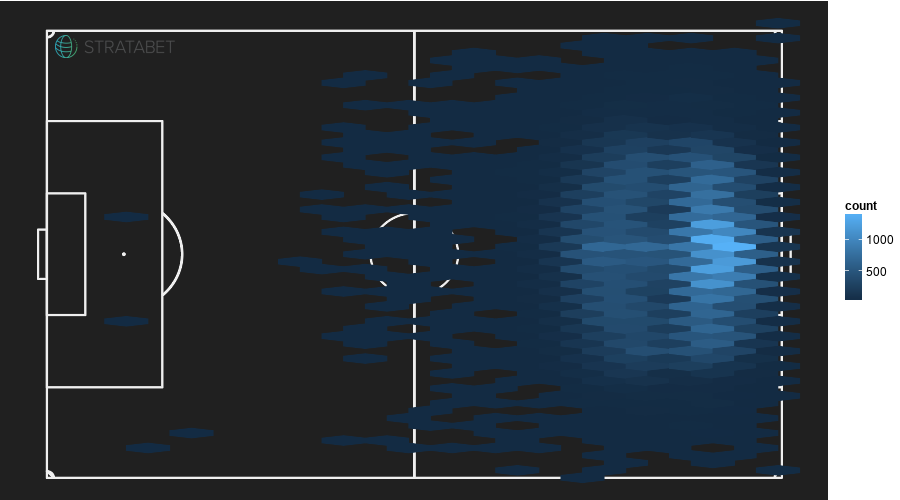

There are some chances recorded from abnormal distance, so let's look closer at them.

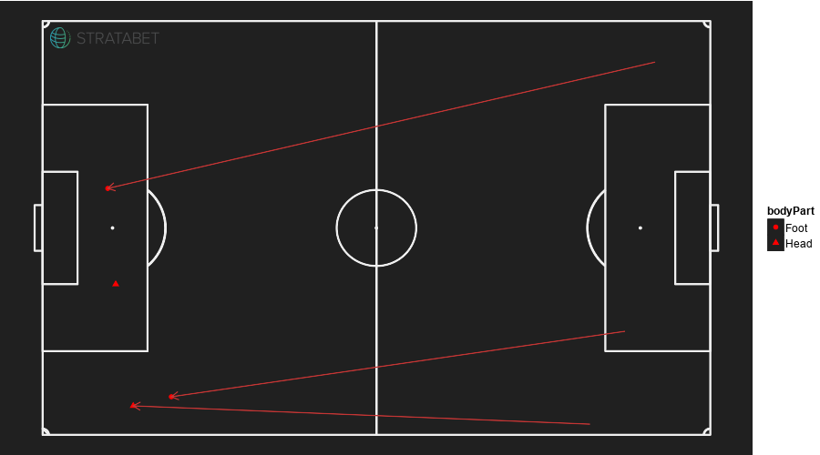

We can see that two of these shots are marked as a shot with Head, which is impossible from such a distance. The third and fourth ones are marked as assisted from the other side of the pitch in 49th and 13th minute of a game, respectively - hence I doubt that were a one of these situations where goalie is off position. So all of these four are just probably incorrectly inputted - I'll remove them so they don't affect a model fit.

``` r
chances <- chances %>% filter(!id %in% temp$id)
```

Now let's create some variables, which may be useful to our xG model.

Starting from the obvious one - goal, as well as the distance and angle from which shot took place. Here, the `angle` is defined to be 0 for shots directly in front of goal, and 1 for shots from the endline. `dist` is distance standarised with maximum possible distance (from the corner on the other side of the pitch).

``` r
chances <- chances %>% 
  mutate(goal = (icon == 'goal'),
         dist = sqrt(location_x^2+location_y^2)/sqrt(136^2 + 420^2),
         angle = abs(atan2(location_x, location_y)/(pi/2)))
```

Let's also create a variable that describes the state (as a goal difference) in which game was in while chance occurred.

``` r
chances <- chances %>% 
  separate(time, c('min', 'sec'), sep = ":", remove = FALSE) %>% 
  group_by(gsm_id) %>% 
  arrange(min, sec, .by_group = TRUE) %>% 
  mutate(hometeam_score = lag(goal * (team == hometeam_team1), default = 0), 
         awayteam_score = lag(goal * (team == awayteam_team2), default = 0),
         game_state = ifelse(team == hometeam_team1, hometeam_score - awayteam_score, awayteam_score - hometeam_score)) %>% 
  select(-hometeam_score, -awayteam_score) %>% 
  ungroup()
```

Finally, we would like to gather infomation from `type`, `bodyPart` and `primaryType` to capture the type of attack. We will differentiate:

1.  chances with Foot after Open Play Pass
2.  chances with Head after Open Play Pass
3.  chances with Other after Open Play Pass
4.  chances with Foot after Cross Low
5.  chances with Head after Cross Low
6.  chances with Other after Cross Low
7.  chances with Foot after Cross High
8.  chances with Head after Cross High
9.  chances with Other after Cross High
10. chances with Foot after Free-Kicks and Corners
11. chances with Head after Free-Kicks and Corners
12. chances with Other after Free-Kicks and Corners
13. Rebounds
14. Direct free-kicks (incl. direct corners)
15. other type of chances without an assist

We could do it by interactions, but then we would have 3\*3\*15 types.

We would like to also keep the information if the type of chance was 'Dangerous Moment' so firstly, we'll just create dichotomous variable `dang_moment`.

``` r
chances <- chances %>% 
  mutate(dang_moment = (type == 'Dangerous Moment'),
      type_of_attack = case_when(
      bodyPart == 'Foot' & primaryType == 'Open Play Pass' ~ paste(bodyPart, primaryType, sep = '_'),
      bodyPart == 'Head' & primaryType == 'Open Play Pass' ~ paste(bodyPart, primaryType, sep = '_'),
      bodyPart == 'Other' & primaryType == 'Open Play Pass' ~ paste(bodyPart, primaryType, sep = '_'),
      bodyPart == 'Foot' & primaryType == 'Cross Low' ~ paste(bodyPart, primaryType, sep = '_'),
      bodyPart == 'Head' & primaryType == 'Cross Low' ~ paste(bodyPart, primaryType, sep = '_'),
      bodyPart == 'Other' & primaryType == 'Cross Low' ~ paste(bodyPart, primaryType, sep = '_'),
      bodyPart == 'Foot' & primaryType == 'Cross High' ~ paste(bodyPart, primaryType, sep = '_'),
      bodyPart == 'Head' & primaryType == 'Cross High' ~ paste(bodyPart, primaryType, sep = '_'),
      bodyPart == 'Other' & primaryType == 'Cross High' ~ paste(bodyPart, primaryType, sep = '_'),
      bodyPart == 'Foot' & primaryType %in% c('Corner', 'Free Kick') ~ paste(bodyPart, primaryType, sep = '_'),
      bodyPart == 'Head' & primaryType %in% c('Corner', 'Free Kick') ~ paste(bodyPart, primaryType, sep = '_'),
      bodyPart == 'Other' & primaryType %in% c('Corner', 'Free Kick') ~ paste(bodyPart, primaryType, sep = '_'),
      primaryType %in% c('Shot (Opposition Rebound)', 'Shot (Deflection)', 'Shot (Woodwork Rebound)') ~
        'Rebound',
      type == 'Direct Free-Kick' ~ 'Direct Free-Kick',
      TRUE ~ 'Other not assisted'
      )
)
```

Now we will parse to factor some variables read in as character.

``` r
chances <- chances %>% mutate(competition = parse_factor(competition, levels = NULL),
                              icon = parse_factor(icon, levels = NULL),
                              chanceRating = parse_factor(chanceRating, 
                                                          levels = c('Poor', 'Fairly good', 
                                                                     'Good', 'Very good',
                                                                     'Great', 'Superb')),
                              type = parse_factor(type, levels = NULL),
                              bodyPart = parse_factor(bodyPart, levels = NULL),
                              shotQuality = parse_factor(shotQuality, levels = 0:5),
                              defPressure = parse_factor(defPressure, levels = 0:5),
                              numDefPlayers = parse_factor(numDefPlayers, levels = 0:11),
                              numAttPlayers = parse_factor(numAttPlayers, levels = 0:11),
                              outcome = parse_factor(outcome, levels = NULL),
                              primaryType = parse_factor(primaryType, levels = NULL),
                              secondaryType = parse_factor(secondaryType, levels = NULL),
                              type_of_attack = parse_factor(type_of_attack, levels = NULL)
                              )
```

And finally, split the data into training and testing set, keeping to the standard 70/30 rule. As previously mentioned, we'll also exclude dangerous moments from our training set.

``` r
set.seed(0)
chances_train <- sample_frac(chances, 0.7, replace = FALSE)
chances_test <- chances %>% filter(!id %in% chances_train$id)
chances_train <- chances_train %>% filter(!dang_moment)
count(chances_train)/count(chances)
```

    ##           n
    ## 1 0.6737941

Now we have around 67% of data set in a training set, but it will do.

Building a xG model
-------------------

In my xG modelling attempt I have employed purposeful selection of covariates. There exist some fancy algorithms one could use (ex. stepwise or best subset selection). But what's the fun then?

``` r
library(lmtest)
library(rms)
library(Epi)
```

### Step 1.

Firstly, we will build univariable models. With `+` sign I mark these covariates which are significant in Wald test at the level of 20%. Note: I deliberately omit `chanceRating` as it is subjective measure, which beyond any doubt depends heavily on other potential covariates as `dist`, `angle`, `defPressure`.

``` r
summary(glm(goal ~ type, family = 'binomial', data = chances_train)) #+
```

    ## 
    ## Call:
    ## glm(formula = goal ~ type, family = "binomial", data = chances_train)
    ## 
    ## Deviance Residuals: 
    ##    Min      1Q  Median      3Q     Max  
    ## -0.523  -0.523  -0.523  -0.523   2.323  
    ## 
    ## Coefficients:
    ##                      Estimate Std. Error z value Pr(>|z|)    
    ## (Intercept)          -1.92023    0.01486  -129.2   <2e-16 ***
    ## typeDirect Free-Kick -0.70796    0.08529    -8.3   <2e-16 ***
    ## ---
    ## Signif. codes:  0 '***' 0.001 '**' 0.01 '*' 0.05 '.' 0.1 ' ' 1
    ## 
    ## (Dispersion parameter for binomial family taken to be 1)
    ## 
    ##     Null deviance: 32235  on 42855  degrees of freedom
    ## Residual deviance: 32152  on 42854  degrees of freedom
    ## AIC: 32156
    ## 
    ## Number of Fisher Scoring iterations: 5

``` r
summary(glm(goal ~ bodyPart, family = 'binomial', data = chances_train)) #+
```

    ## 
    ## Call:
    ## glm(formula = goal ~ bodyPart, family = "binomial", data = chances_train)
    ## 
    ## Deviance Residuals: 
    ##     Min       1Q   Median       3Q      Max  
    ## -1.0247  -0.5075  -0.5075  -0.5075   2.0559  
    ## 
    ## Coefficients:
    ##               Estimate Std. Error  z value Pr(>|z|)    
    ## (Intercept)   -1.98468    0.01631 -121.675  < 2e-16 ***
    ## bodyPartHead   0.14961    0.03762    3.977 6.99e-05 ***
    ## bodyPartOther  1.61431    0.17150    9.413  < 2e-16 ***
    ## ---
    ## Signif. codes:  0 '***' 0.001 '**' 0.01 '*' 0.05 '.' 0.1 ' ' 1
    ## 
    ## (Dispersion parameter for binomial family taken to be 1)
    ## 
    ##     Null deviance: 32235  on 42855  degrees of freedom
    ## Residual deviance: 32148  on 42853  degrees of freedom
    ## AIC: 32154
    ## 
    ## Number of Fisher Scoring iterations: 4

``` r
summary(glm(goal ~ shotQuality, family = 'binomial', data = chances_train)) #+
```

    ## 
    ## Call:
    ## glm(formula = goal ~ shotQuality, family = "binomial", data = chances_train)
    ## 
    ## Deviance Residuals: 
    ##     Min       1Q   Median       3Q      Max  
    ## -2.5601  -0.2143  -0.2143  -0.0695   3.4716  
    ## 
    ## Coefficients:
    ##              Estimate Std. Error z value Pr(>|z|)    
    ## (Intercept)   -1.4046     0.1519  -9.249  < 2e-16 ***
    ## shotQuality1  -4.6188     0.2292 -20.151  < 2e-16 ***
    ## shotQuality2  -2.3579     0.1616 -14.592  < 2e-16 ***
    ## shotQuality3   0.5550     0.1532   3.622 0.000292 ***
    ## shotQuality4   1.9479     0.1591  12.244  < 2e-16 ***
    ## shotQuality5   4.6433     0.3564  13.030  < 2e-16 ***
    ## ---
    ## Signif. codes:  0 '***' 0.001 '**' 0.01 '*' 0.05 '.' 0.1 ' ' 1
    ## 
    ## (Dispersion parameter for binomial family taken to be 1)
    ## 
    ##     Null deviance: 32235  on 42855  degrees of freedom
    ## Residual deviance: 20630  on 42850  degrees of freedom
    ## AIC: 20642
    ## 
    ## Number of Fisher Scoring iterations: 8

``` r
summary(glm(goal ~ defPressure, family = 'binomial', data = chances_train)) #+
```

    ## 
    ## Call:
    ## glm(formula = goal ~ defPressure, family = "binomial", data = chances_train)
    ## 
    ## Deviance Residuals: 
    ##     Min       1Q   Median       3Q      Max  
    ## -0.5773  -0.5616  -0.5071  -0.4156   2.5381  
    ## 
    ## Coefficients:
    ##              Estimate Std. Error z value Pr(>|z|)    
    ## (Intercept)  -1.70731    0.03228 -52.897  < 2e-16 ***
    ## defPressure1 -0.05992    0.04327  -1.385    0.166    
    ## defPressure2 -0.27911    0.04455  -6.265 3.73e-10 ***
    ## defPressure3 -0.31721    0.04526  -7.009 2.40e-12 ***
    ## defPressure4 -0.69843    0.05996 -11.649  < 2e-16 ***
    ## defPressure5 -1.47282    0.16452  -8.952  < 2e-16 ***
    ## ---
    ## Signif. codes:  0 '***' 0.001 '**' 0.01 '*' 0.05 '.' 0.1 ' ' 1
    ## 
    ## (Dispersion parameter for binomial family taken to be 1)
    ## 
    ##     Null deviance: 32235  on 42855  degrees of freedom
    ## Residual deviance: 31957  on 42850  degrees of freedom
    ## AIC: 31969
    ## 
    ## Number of Fisher Scoring iterations: 5

``` r
summary(glm(goal ~ numDefPlayers, family = 'binomial', data = chances_train)) #+
```

    ## 
    ## Call:
    ## glm(formula = goal ~ numDefPlayers, family = "binomial", data = chances_train)
    ## 
    ## Deviance Residuals: 
    ##     Min       1Q   Median       3Q      Max  
    ## -1.7533  -0.4709  -0.3754  -0.3229   2.4767  
    ## 
    ## Coefficients:
    ##                 Estimate Std. Error z value Pr(>|z|)    
    ## (Intercept)       1.2949     0.1112  11.643  < 2e-16 ***
    ## numDefPlayers1   -2.1931     0.1141 -19.228  < 2e-16 ***
    ## numDefPlayers2   -3.4384     0.1144 -30.068  < 2e-16 ***
    ## numDefPlayers3   -3.9124     0.1176 -33.268  < 2e-16 ***
    ## numDefPlayers4   -4.3143     0.1308 -32.979  < 2e-16 ***
    ## numDefPlayers5   -4.2227     0.1484 -28.448  < 2e-16 ***
    ## numDefPlayers6   -4.1834     0.1714 -24.400  < 2e-16 ***
    ## numDefPlayers7   -3.8224     0.1921 -19.896  < 2e-16 ***
    ## numDefPlayers8   -3.8882     0.2820 -13.787  < 2e-16 ***
    ## numDefPlayers9   -3.8598     0.5307  -7.274 3.50e-13 ***
    ## numDefPlayers10  -3.1667     0.7677  -4.125 3.71e-05 ***
    ## numDefPlayers11 -11.8609    84.4767  -0.140    0.888    
    ## ---
    ## Signif. codes:  0 '***' 0.001 '**' 0.01 '*' 0.05 '.' 0.1 ' ' 1
    ## 
    ## (Dispersion parameter for binomial family taken to be 1)
    ## 
    ##     Null deviance: 32235  on 42855  degrees of freedom
    ## Residual deviance: 28694  on 42844  degrees of freedom
    ## AIC: 28718
    ## 
    ## Number of Fisher Scoring iterations: 9

``` r
summary(glm(goal ~ numAttPlayers, family = 'binomial', data = chances_train)) #+
```

    ## 
    ## Call:
    ## glm(formula = goal ~ numAttPlayers, family = "binomial", data = chances_train)
    ## 
    ## Deviance Residuals: 
    ##     Min       1Q   Median       3Q      Max  
    ## -0.5660  -0.5660  -0.5660  -0.3647   2.4305  
    ## 
    ## Coefficients:
    ##                 Estimate Std. Error  z value Pr(>|z|)    
    ## (Intercept)     -1.75045    0.01592 -109.977  < 2e-16 ***
    ## numAttPlayers1  -0.92643    0.04764  -19.445  < 2e-16 ***
    ## numAttPlayers2  -1.14965    0.09324  -12.330  < 2e-16 ***
    ## numAttPlayers3  -0.99712    0.15811   -6.306 2.86e-10 ***
    ## numAttPlayers4  -1.11492    0.34306   -3.250  0.00115 ** 
    ## numAttPlayers5  -0.73446    0.73615   -0.998  0.31842    
    ## numAttPlayers6 -10.81562  114.81424   -0.094  0.92495    
    ## numAttPlayers7 -10.81562  229.62847   -0.047  0.96243    
    ## ---
    ## Signif. codes:  0 '***' 0.001 '**' 0.01 '*' 0.05 '.' 0.1 ' ' 1
    ## 
    ## (Dispersion parameter for binomial family taken to be 1)
    ## 
    ##     Null deviance: 32235  on 42855  degrees of freedom
    ## Residual deviance: 31572  on 42848  degrees of freedom
    ## AIC: 31588
    ## 
    ## Number of Fisher Scoring iterations: 11

``` r
chances_train %>% group_by(numAttPlayers) %>% count()
```

    ## # A tibble: 8 x 2
    ## # Groups:   numAttPlayers [8]
    ##   numAttPlayers     n
    ##          <fctr> <int>
    ## 1             0 31306
    ## 2             1  8236
    ## 3             2  2397
    ## 4             3   714
    ## 5             4   167
    ## 6             5    26
    ## 7             6     8
    ## 8             7     2

Statistical insignificance of coefficients associated with levels: 5, 6, 7 could be driven by a small counts of these levels. Let's try to group them as one level.

``` r
chances_train <- chances_train %>% 
  mutate(numAttPlayers2 = fct_collapse(numAttPlayers, '>4' = c('5', '6', '7')))
summary(glm(goal ~ numAttPlayers2, family = 'binomial', data = chances_train)) #+
```

    ## 
    ## Call:
    ## glm(formula = goal ~ numAttPlayers2, family = "binomial", data = chances_train)
    ## 
    ## Deviance Residuals: 
    ##     Min       1Q   Median       3Q      Max  
    ## -0.5660  -0.5660  -0.5660  -0.3647   2.4305  
    ## 
    ## Coefficients:
    ##                  Estimate Std. Error  z value Pr(>|z|)    
    ## (Intercept)      -1.75045    0.01592 -109.977  < 2e-16 ***
    ## numAttPlayers21  -0.92643    0.04764  -19.445  < 2e-16 ***
    ## numAttPlayers22  -1.14965    0.09324  -12.331  < 2e-16 ***
    ## numAttPlayers23  -0.99712    0.15811   -6.306 2.85e-10 ***
    ## numAttPlayers24  -1.11492    0.34306   -3.250  0.00115 ** 
    ## numAttPlayers2>4 -1.08277    0.72777   -1.488  0.13681    
    ## ---
    ## Signif. codes:  0 '***' 0.001 '**' 0.01 '*' 0.05 '.' 0.1 ' ' 1
    ## 
    ## (Dispersion parameter for binomial family taken to be 1)
    ## 
    ##     Null deviance: 32235  on 42855  degrees of freedom
    ## Residual deviance: 31573  on 42850  degrees of freedom
    ## AIC: 31585
    ## 
    ## Number of Fisher Scoring iterations: 5

The p-value of Wald test decreased to 0.14 after grouping the variable, so it's probably better to leave this levels as a group.

``` r
chances_train <- chances_train %>% mutate(numAttPlayers = numAttPlayers2) %>% select(-numAttPlayers2)
```

``` r
summary(glm(goal ~ dist, family = 'binomial', data = chances_train)) #+
```

    ## 
    ## Call:
    ## glm(formula = goal ~ dist, family = "binomial", data = chances_train)
    ## 
    ## Deviance Residuals: 
    ##     Min       1Q   Median       3Q      Max  
    ## -1.1193  -0.5796  -0.3726  -0.2240   4.0333  
    ## 
    ## Coefficients:
    ##              Estimate Std. Error z value Pr(>|z|)    
    ## (Intercept)   0.12665    0.03619   3.499 0.000467 ***
    ## dist        -15.35907    0.28594 -53.715  < 2e-16 ***
    ## ---
    ## Signif. codes:  0 '***' 0.001 '**' 0.01 '*' 0.05 '.' 0.1 ' ' 1
    ## 
    ## (Dispersion parameter for binomial family taken to be 1)
    ## 
    ##     Null deviance: 32235  on 42855  degrees of freedom
    ## Residual deviance: 28415  on 42854  degrees of freedom
    ## AIC: 28419
    ## 
    ## Number of Fisher Scoring iterations: 6

``` r
summary(glm(goal ~ angle, family = 'binomial', data = chances_train)) #+
```

    ## 
    ## Call:
    ## glm(formula = goal ~ angle, family = "binomial", data = chances_train)
    ## 
    ## Deviance Residuals: 
    ##     Min       1Q   Median       3Q      Max  
    ## -0.5395  -0.5198  -0.5135  -0.5081   2.0591  
    ## 
    ## Coefficients:
    ##             Estimate Std. Error z value Pr(>|z|)    
    ## (Intercept) -1.99196    0.02618 -76.075   <2e-16 ***
    ## angle        0.13821    0.06954   1.987   0.0469 *  
    ## ---
    ## Signif. codes:  0 '***' 0.001 '**' 0.01 '*' 0.05 '.' 0.1 ' ' 1
    ## 
    ## (Dispersion parameter for binomial family taken to be 1)
    ## 
    ##     Null deviance: 32235  on 42855  degrees of freedom
    ## Residual deviance: 32231  on 42854  degrees of freedom
    ## AIC: 32235
    ## 
    ## Number of Fisher Scoring iterations: 4

``` r
summary(glm(goal ~ game_state, family = 'binomial', data = chances_train)) #+
```

    ## 
    ## Call:
    ## glm(formula = goal ~ game_state, family = "binomial", data = chances_train)
    ## 
    ## Deviance Residuals: 
    ##     Min       1Q   Median       3Q      Max  
    ## -0.5524  -0.5158  -0.5158  -0.5158   2.1037  
    ## 
    ## Coefficients:
    ##             Estimate Std. Error  z value Pr(>|z|)    
    ## (Intercept) -1.94992    0.01463 -133.242   <2e-16 ***
    ## game_state   0.14707    0.04386    3.353    8e-04 ***
    ## ---
    ## Signif. codes:  0 '***' 0.001 '**' 0.01 '*' 0.05 '.' 0.1 ' ' 1
    ## 
    ## (Dispersion parameter for binomial family taken to be 1)
    ## 
    ##     Null deviance: 32235  on 42855  degrees of freedom
    ## Residual deviance: 32224  on 42854  degrees of freedom
    ## AIC: 32228
    ## 
    ## Number of Fisher Scoring iterations: 4

``` r
summary(glm(goal ~ type_of_attack, family = 'binomial', data = chances_train)) #+
```

    ## 
    ## Call:
    ## glm(formula = goal ~ type_of_attack, family = "binomial", data = chances_train)
    ## 
    ## Deviance Residuals: 
    ##     Min       1Q   Median       3Q      Max  
    ## -1.4132  -0.4910  -0.4910  -0.3852   2.3217  
    ## 
    ## Coefficients:
    ##                                    Estimate Std. Error z value Pr(>|z|)
    ## (Intercept)                        -2.05476    0.02254 -91.150  < 2e-16
    ## type_of_attackOther not assisted   -0.50918    0.05029 -10.125  < 2e-16
    ## type_of_attackDirect Free-Kick     -0.57049    0.08724  -6.540 6.17e-11
    ## type_of_attackHead_Cross High       0.25711    0.05419   4.745 2.09e-06
    ## type_of_attackHead_Corner          -0.09137    0.07296  -1.252 0.210402
    ## type_of_attackRebound               1.77908    0.06860  25.933  < 2e-16
    ## type_of_attackFoot_Cross High       0.24520    0.07433   3.299 0.000970
    ## type_of_attackFoot_Free Kick        0.26081    0.12591   2.071 0.038328
    ## type_of_attackHead_Free Kick        0.07154    0.09840   0.727 0.467237
    ## type_of_attackFoot_Corner          -0.24631    0.13106  -1.879 0.060197
    ## type_of_attackFoot_Cross Low        0.99337    0.05029  19.753  < 2e-16
    ## type_of_attackOther_Cross Low       1.83162    0.47488   3.857 0.000115
    ## type_of_attackOther_Free Kick       0.44532    0.63286   0.704 0.481640
    ## type_of_attackHead_Open Play Pass   0.96367    0.12457   7.736 1.03e-14
    ## type_of_attackOther_Cross High      0.87610    0.40493   2.164 0.030496
    ## type_of_attackHead_Cross Low        1.17056    0.27364   4.278 1.89e-05
    ## type_of_attackOther_Open Play Pass  2.59376    0.47613   5.448 5.11e-08
    ## type_of_attackOther_Corner          0.49661    0.55058   0.902 0.367067
    ##                                       
    ## (Intercept)                        ***
    ## type_of_attackOther not assisted   ***
    ## type_of_attackDirect Free-Kick     ***
    ## type_of_attackHead_Cross High      ***
    ## type_of_attackHead_Corner             
    ## type_of_attackRebound              ***
    ## type_of_attackFoot_Cross High      ***
    ## type_of_attackFoot_Free Kick       *  
    ## type_of_attackHead_Free Kick          
    ## type_of_attackFoot_Corner          .  
    ## type_of_attackFoot_Cross Low       ***
    ## type_of_attackOther_Cross Low      ***
    ## type_of_attackOther_Free Kick         
    ## type_of_attackHead_Open Play Pass  ***
    ## type_of_attackOther_Cross High     *  
    ## type_of_attackHead_Cross Low       ***
    ## type_of_attackOther_Open Play Pass ***
    ## type_of_attackOther_Corner            
    ## ---
    ## Signif. codes:  0 '***' 0.001 '**' 0.01 '*' 0.05 '.' 0.1 ' ' 1
    ## 
    ## (Dispersion parameter for binomial family taken to be 1)
    ## 
    ##     Null deviance: 32235  on 42855  degrees of freedom
    ## Residual deviance: 30886  on 42838  degrees of freedom
    ## AIC: 30922
    ## 
    ## Number of Fisher Scoring iterations: 5

Let's try to group chances after corners to see if we can get one level with competitive p-value.

``` r
chances_train <- chances_train %>% 
  mutate(type_of_attack2 = fct_collapse(type_of_attack, 
                                        'Corner' = c('Foot_Corner', 'Head_Corner', 'Other_Corner')
  ))
summary(glm(goal ~ type_of_attack2, family = 'binomial', data = chances_train)) #+
```

    ## 
    ## Call:
    ## glm(formula = goal ~ type_of_attack2, family = "binomial", data = chances_train)
    ## 
    ## Deviance Residuals: 
    ##     Min       1Q   Median       3Q      Max  
    ## -1.4132  -0.4910  -0.4910  -0.3852   2.3217  
    ## 
    ## Coefficients:
    ##                                     Estimate Std. Error z value Pr(>|z|)
    ## (Intercept)                         -2.05476    0.02254 -91.150  < 2e-16
    ## type_of_attack2Other not assisted   -0.50918    0.05029 -10.125  < 2e-16
    ## type_of_attack2Direct Free-Kick     -0.57049    0.08724  -6.540 6.17e-11
    ## type_of_attack2Head_Cross High       0.25711    0.05419   4.745 2.09e-06
    ## type_of_attack2Corner               -0.12165    0.06477  -1.878 0.060360
    ## type_of_attack2Rebound               1.77908    0.06860  25.933  < 2e-16
    ## type_of_attack2Foot_Cross High       0.24520    0.07433   3.299 0.000970
    ## type_of_attack2Foot_Free Kick        0.26081    0.12591   2.071 0.038328
    ## type_of_attack2Head_Free Kick        0.07154    0.09840   0.727 0.467237
    ## type_of_attack2Foot_Cross Low        0.99337    0.05029  19.753  < 2e-16
    ## type_of_attack2Other_Cross Low       1.83162    0.47488   3.857 0.000115
    ## type_of_attack2Other_Free Kick       0.44532    0.63286   0.704 0.481640
    ## type_of_attack2Head_Open Play Pass   0.96367    0.12457   7.736 1.03e-14
    ## type_of_attack2Other_Cross High      0.87610    0.40493   2.164 0.030496
    ## type_of_attack2Head_Cross Low        1.17056    0.27364   4.278 1.89e-05
    ## type_of_attack2Other_Open Play Pass  2.59376    0.47613   5.448 5.11e-08
    ##                                        
    ## (Intercept)                         ***
    ## type_of_attack2Other not assisted   ***
    ## type_of_attack2Direct Free-Kick     ***
    ## type_of_attack2Head_Cross High      ***
    ## type_of_attack2Corner               .  
    ## type_of_attack2Rebound              ***
    ## type_of_attack2Foot_Cross High      ***
    ## type_of_attack2Foot_Free Kick       *  
    ## type_of_attack2Head_Free Kick          
    ## type_of_attack2Foot_Cross Low       ***
    ## type_of_attack2Other_Cross Low      ***
    ## type_of_attack2Other_Free Kick         
    ## type_of_attack2Head_Open Play Pass  ***
    ## type_of_attack2Other_Cross High     *  
    ## type_of_attack2Head_Cross Low       ***
    ## type_of_attack2Other_Open Play Pass ***
    ## ---
    ## Signif. codes:  0 '***' 0.001 '**' 0.01 '*' 0.05 '.' 0.1 ' ' 1
    ## 
    ## (Dispersion parameter for binomial family taken to be 1)
    ## 
    ##     Null deviance: 32235  on 42855  degrees of freedom
    ## Residual deviance: 30888  on 42840  degrees of freedom
    ## AIC: 30920
    ## 
    ## Number of Fisher Scoring iterations: 5

Grouping shots taken after corners resulted in comparable p-value in Wald test, so we keep these chances as one type\_of\_attack in order to slightly simplify a model. What about chances after free-kicks (excl. direct free kicks)?

``` r
chances_train <- chances_train %>% 
  mutate(type_of_attack3 = fct_collapse(type_of_attack2,
                                        'Free Kick' = c('Foot_Free Kick', 'Head_Free Kick', 
                                                        'Other_Free Kick')))
summary(glm(goal ~ type_of_attack3, family = 'binomial', data = chances_train)) #+
```

    ## 
    ## Call:
    ## glm(formula = goal ~ type_of_attack3, family = "binomial", data = chances_train)
    ## 
    ## Deviance Residuals: 
    ##     Min       1Q   Median       3Q      Max  
    ## -1.4132  -0.4910  -0.4910  -0.3852   2.3217  
    ## 
    ## Coefficients:
    ##                                     Estimate Std. Error z value Pr(>|z|)
    ## (Intercept)                         -2.05476    0.02254 -91.150  < 2e-16
    ## type_of_attack3Other not assisted   -0.50918    0.05029 -10.125  < 2e-16
    ## type_of_attack3Direct Free-Kick     -0.57049    0.08724  -6.540 6.17e-11
    ## type_of_attack3Head_Cross High       0.25711    0.05419   4.745 2.09e-06
    ## type_of_attack3Corner               -0.12165    0.06477  -1.878 0.060360
    ## type_of_attack3Rebound               1.77908    0.06860  25.933  < 2e-16
    ## type_of_attack3Foot_Cross High       0.24520    0.07433   3.299 0.000970
    ## type_of_attack3Free Kick             0.14321    0.07850   1.824 0.068107
    ## type_of_attack3Foot_Cross Low        0.99337    0.05029  19.753  < 2e-16
    ## type_of_attack3Other_Cross Low       1.83162    0.47488   3.857 0.000115
    ## type_of_attack3Head_Open Play Pass   0.96367    0.12457   7.736 1.03e-14
    ## type_of_attack3Other_Cross High      0.87610    0.40493   2.164 0.030496
    ## type_of_attack3Head_Cross Low        1.17056    0.27364   4.278 1.89e-05
    ## type_of_attack3Other_Open Play Pass  2.59376    0.47613   5.448 5.11e-08
    ##                                        
    ## (Intercept)                         ***
    ## type_of_attack3Other not assisted   ***
    ## type_of_attack3Direct Free-Kick     ***
    ## type_of_attack3Head_Cross High      ***
    ## type_of_attack3Corner               .  
    ## type_of_attack3Rebound              ***
    ## type_of_attack3Foot_Cross High      ***
    ## type_of_attack3Free Kick            .  
    ## type_of_attack3Foot_Cross Low       ***
    ## type_of_attack3Other_Cross Low      ***
    ## type_of_attack3Head_Open Play Pass  ***
    ## type_of_attack3Other_Cross High     *  
    ## type_of_attack3Head_Cross Low       ***
    ## type_of_attack3Other_Open Play Pass ***
    ## ---
    ## Signif. codes:  0 '***' 0.001 '**' 0.01 '*' 0.05 '.' 0.1 ' ' 1
    ## 
    ## (Dispersion parameter for binomial family taken to be 1)
    ## 
    ##     Null deviance: 32235  on 42855  degrees of freedom
    ## Residual deviance: 30890  on 42842  degrees of freedom
    ## AIC: 30918
    ## 
    ## Number of Fisher Scoring iterations: 5

Also grouping chances after free kicks (excluding direct free kicks) seems to be reasonable as it results in simpler model and fairly low p-value of Wald test.

``` r
chances_train <- chances_train %>% 
  mutate(type_of_attack = type_of_attack3) %>% 
  select(-type_of_attack2, -type_of_attack3)

chances_test <- chances_test %>% mutate(type_of_attack = fct_collapse(type_of_attack, 
                                        'Corner' = c('Foot_Corner', 'Head_Corner', 'Other_Corner'),
                                        'Free Kick' = c('Foot_Free Kick', 'Head_Free Kick', 
                                                        'Other_Free Kick')))
```

### Step 2.

In the second step we build a model with all variables selected in step 1. Then we check which covariates are insignificant and if removing them will make a difference.

``` r
model2 <- glm(goal ~ shotQuality + defPressure + numDefPlayers +
              numAttPlayers + dist + angle + game_state + type_of_attack, 
              family = 'binomial', data = chances_train)
summary(model2)
```

    ## 
    ## Call:
    ## glm(formula = goal ~ shotQuality + defPressure + numDefPlayers + 
    ##     numAttPlayers + dist + angle + game_state + type_of_attack, 
    ##     family = "binomial", data = chances_train)
    ## 
    ## Deviance Residuals: 
    ##     Min       1Q   Median       3Q      Max  
    ## -3.1816  -0.2344  -0.0774  -0.0235   4.4065  
    ## 
    ## Coefficients:
    ##                                     Estimate Std. Error z value Pr(>|z|)
    ## (Intercept)                          4.45259    0.28191  15.794  < 2e-16
    ## shotQuality1                        -4.52922    0.26763 -16.923  < 2e-16
    ## shotQuality2                        -2.02597    0.20442  -9.911  < 2e-16
    ## shotQuality3                         0.91353    0.19757   4.624 3.77e-06
    ## shotQuality4                         3.46441    0.20732  16.710  < 2e-16
    ## shotQuality5                         7.53514    0.42554  17.707  < 2e-16
    ## defPressure1                         0.10029    0.07078   1.417  0.15647
    ## defPressure2                        -0.02062    0.07177  -0.287  0.77386
    ## defPressure3                        -0.16874    0.07240  -2.331  0.01977
    ## defPressure4                        -0.61102    0.08908  -6.859 6.94e-12
    ## defPressure5                        -1.02560    0.20853  -4.918 8.73e-07
    ## numDefPlayers1                      -2.27047    0.18694 -12.146  < 2e-16
    ## numDefPlayers2                      -3.00841    0.18971 -15.858  < 2e-16
    ## numDefPlayers3                      -3.12520    0.19574 -15.966  < 2e-16
    ## numDefPlayers4                      -3.33263    0.21278 -15.662  < 2e-16
    ## numDefPlayers5                      -3.18765    0.24555 -12.982  < 2e-16
    ## numDefPlayers6                      -3.27560    0.29701 -11.029  < 2e-16
    ## numDefPlayers7                      -3.11525    0.34103  -9.135  < 2e-16
    ## numDefPlayers8                      -3.93836    0.50565  -7.789 6.77e-15
    ## numDefPlayers9                      -4.84738    1.05206  -4.608 4.07e-06
    ## numDefPlayers10                     -4.03878    1.42752  -2.829  0.00467
    ## numDefPlayers11                    -14.96053  126.60548  -0.118  0.90594
    ## numAttPlayers1                      -0.13922    0.07315  -1.903  0.05703
    ## numAttPlayers2                      -0.14469    0.15569  -0.929  0.35270
    ## numAttPlayers3                      -0.11297    0.27377  -0.413  0.67986
    ## numAttPlayers4                      -0.17879    0.53065  -0.337  0.73617
    ## numAttPlayers>4                      0.61796    1.06710   0.579  0.56252
    ## dist                               -22.06551    0.57207 -38.571  < 2e-16
    ## angle                               -1.12045    0.10196 -10.989  < 2e-16
    ## game_state                           0.09261    0.06223   1.488  0.13668
    ## type_of_attackOther not assisted    -0.22132    0.07052  -3.138  0.00170
    ## type_of_attackDirect Free-Kick       0.74213    0.18594   3.991 6.58e-05
    ## type_of_attackHead_Cross High       -1.03176    0.08186 -12.604  < 2e-16
    ## type_of_attackCorner                -0.82544    0.09657  -8.547  < 2e-16
    ## type_of_attackRebound                0.66626    0.11093   6.006 1.90e-09
    ## type_of_attackFoot_Cross High       -0.50793    0.11016  -4.611 4.01e-06
    ## type_of_attackFree Kick             -0.60179    0.11388  -5.284 1.26e-07
    ## type_of_attackFoot_Cross Low        -0.09806    0.07928  -1.237  0.21616
    ## type_of_attackOther_Cross Low        0.32366    0.77550   0.417  0.67641
    ## type_of_attackHead_Open Play Pass   -0.43939    0.18588  -2.364  0.01809
    ## type_of_attackOther_Cross High       1.67510    0.57746   2.901  0.00372
    ## type_of_attackHead_Cross Low        -0.48560    0.39952  -1.215  0.22419
    ## type_of_attackOther_Open Play Pass   1.34700    0.71410   1.886  0.05925
    ##                                       
    ## (Intercept)                        ***
    ## shotQuality1                       ***
    ## shotQuality2                       ***
    ## shotQuality3                       ***
    ## shotQuality4                       ***
    ## shotQuality5                       ***
    ## defPressure1                          
    ## defPressure2                          
    ## defPressure3                       *  
    ## defPressure4                       ***
    ## defPressure5                       ***
    ## numDefPlayers1                     ***
    ## numDefPlayers2                     ***
    ## numDefPlayers3                     ***
    ## numDefPlayers4                     ***
    ## numDefPlayers5                     ***
    ## numDefPlayers6                     ***
    ## numDefPlayers7                     ***
    ## numDefPlayers8                     ***
    ## numDefPlayers9                     ***
    ## numDefPlayers10                    ** 
    ## numDefPlayers11                       
    ## numAttPlayers1                     .  
    ## numAttPlayers2                        
    ## numAttPlayers3                        
    ## numAttPlayers4                        
    ## numAttPlayers>4                       
    ## dist                               ***
    ## angle                              ***
    ## game_state                            
    ## type_of_attackOther not assisted   ** 
    ## type_of_attackDirect Free-Kick     ***
    ## type_of_attackHead_Cross High      ***
    ## type_of_attackCorner               ***
    ## type_of_attackRebound              ***
    ## type_of_attackFoot_Cross High      ***
    ## type_of_attackFree Kick            ***
    ## type_of_attackFoot_Cross Low          
    ## type_of_attackOther_Cross Low         
    ## type_of_attackHead_Open Play Pass  *  
    ## type_of_attackOther_Cross High     ** 
    ## type_of_attackHead_Cross Low          
    ## type_of_attackOther_Open Play Pass .  
    ## ---
    ## Signif. codes:  0 '***' 0.001 '**' 0.01 '*' 0.05 '.' 0.1 ' ' 1
    ## 
    ## (Dispersion parameter for binomial family taken to be 1)
    ## 
    ##     Null deviance: 32235  on 42855  degrees of freedom
    ## Residual deviance: 14769  on 42813  degrees of freedom
    ## AIC: 14855
    ## 
    ## Number of Fisher Scoring iterations: 10

numAttPlayers is a variable without at least one significant level coefficient. So let's see how removing it will impact the model.

``` r
model2a <- glm(goal ~ shotQuality + defPressure + numDefPlayers + dist + angle +
                 game_state + type_of_attack, family = 'binomial', data = chances_train)
summary(model2a)
```

    ## 
    ## Call:
    ## glm(formula = goal ~ shotQuality + defPressure + numDefPlayers + 
    ##     dist + angle + game_state + type_of_attack, family = "binomial", 
    ##     data = chances_train)
    ## 
    ## Deviance Residuals: 
    ##     Min       1Q   Median       3Q      Max  
    ## -3.1966  -0.2345  -0.0773  -0.0236   4.4137  
    ## 
    ## Coefficients:
    ##                                     Estimate Std. Error z value Pr(>|z|)
    ## (Intercept)                          4.44189    0.28165  15.771  < 2e-16
    ## shotQuality1                        -4.52426    0.26740 -16.919  < 2e-16
    ## shotQuality2                        -2.02349    0.20418  -9.910  < 2e-16
    ## shotQuality3                         0.91682    0.19732   4.646 3.38e-06
    ## shotQuality4                         3.46741    0.20707  16.745  < 2e-16
    ## shotQuality5                         7.53045    0.42609  17.673  < 2e-16
    ## defPressure1                         0.10378    0.07068   1.468  0.14203
    ## defPressure2                        -0.01523    0.07165  -0.213  0.83161
    ## defPressure3                        -0.15923    0.07217  -2.206  0.02735
    ## defPressure4                        -0.59865    0.08879  -6.743 1.56e-11
    ## defPressure5                        -1.00967    0.20845  -4.844 1.27e-06
    ## numDefPlayers1                      -2.26858    0.18686 -12.141  < 2e-16
    ## numDefPlayers2                      -3.01561    0.18958 -15.907  < 2e-16
    ## numDefPlayers3                      -3.16104    0.19484 -16.223  < 2e-16
    ## numDefPlayers4                      -3.39916    0.21010 -16.179  < 2e-16
    ## numDefPlayers5                      -3.27696    0.23952 -13.682  < 2e-16
    ## numDefPlayers6                      -3.38375    0.28680 -11.798  < 2e-16
    ## numDefPlayers7                      -3.22840    0.31760 -10.165  < 2e-16
    ## numDefPlayers8                      -4.04524    0.48747  -8.299  < 2e-16
    ## numDefPlayers9                      -4.95476    1.02950  -4.813 1.49e-06
    ## numDefPlayers10                     -4.06301    1.44667  -2.809  0.00498
    ## numDefPlayers11                    -15.09847  126.60024  -0.119  0.90507
    ## dist                               -22.10161    0.57077 -38.723  < 2e-16
    ## angle                               -1.10869    0.10177 -10.894  < 2e-16
    ## game_state                           0.09273    0.06221   1.491  0.13607
    ## type_of_attackOther not assisted    -0.22333    0.07050  -3.168  0.00154
    ## type_of_attackDirect Free-Kick       0.74404    0.18599   4.000 6.33e-05
    ## type_of_attackHead_Cross High       -1.03210    0.08181 -12.615  < 2e-16
    ## type_of_attackCorner                -0.84372    0.09603  -8.786  < 2e-16
    ## type_of_attackRebound                0.65942    0.11082   5.950 2.68e-09
    ## type_of_attackFoot_Cross High       -0.51095    0.11008  -4.642 3.46e-06
    ## type_of_attackFree Kick             -0.61390    0.11364  -5.402 6.58e-08
    ## type_of_attackFoot_Cross Low        -0.10239    0.07920  -1.293  0.19609
    ## type_of_attackOther_Cross Low        0.32362    0.77524   0.417  0.67635
    ## type_of_attackHead_Open Play Pass   -0.45487    0.18570  -2.449  0.01431
    ## type_of_attackOther_Cross High       1.67444    0.57706   2.902  0.00371
    ## type_of_attackHead_Cross Low        -0.48444    0.40014  -1.211  0.22602
    ## type_of_attackOther_Open Play Pass   1.34822    0.71280   1.891  0.05856
    ##                                       
    ## (Intercept)                        ***
    ## shotQuality1                       ***
    ## shotQuality2                       ***
    ## shotQuality3                       ***
    ## shotQuality4                       ***
    ## shotQuality5                       ***
    ## defPressure1                          
    ## defPressure2                          
    ## defPressure3                       *  
    ## defPressure4                       ***
    ## defPressure5                       ***
    ## numDefPlayers1                     ***
    ## numDefPlayers2                     ***
    ## numDefPlayers3                     ***
    ## numDefPlayers4                     ***
    ## numDefPlayers5                     ***
    ## numDefPlayers6                     ***
    ## numDefPlayers7                     ***
    ## numDefPlayers8                     ***
    ## numDefPlayers9                     ***
    ## numDefPlayers10                    ** 
    ## numDefPlayers11                       
    ## dist                               ***
    ## angle                              ***
    ## game_state                            
    ## type_of_attackOther not assisted   ** 
    ## type_of_attackDirect Free-Kick     ***
    ## type_of_attackHead_Cross High      ***
    ## type_of_attackCorner               ***
    ## type_of_attackRebound              ***
    ## type_of_attackFoot_Cross High      ***
    ## type_of_attackFree Kick            ***
    ## type_of_attackFoot_Cross Low          
    ## type_of_attackOther_Cross Low         
    ## type_of_attackHead_Open Play Pass  *  
    ## type_of_attackOther_Cross High     ** 
    ## type_of_attackHead_Cross Low          
    ## type_of_attackOther_Open Play Pass .  
    ## ---
    ## Signif. codes:  0 '***' 0.001 '**' 0.01 '*' 0.05 '.' 0.1 ' ' 1
    ## 
    ## (Dispersion parameter for binomial family taken to be 1)
    ## 
    ##     Null deviance: 32235  on 42855  degrees of freedom
    ## Residual deviance: 14774  on 42818  degrees of freedom
    ## AIC: 14850
    ## 
    ## Number of Fisher Scoring iterations: 10

``` r
lrtest(model2a, model2)
```

    ## 
    ## Model 1: goal ~ shotQuality + defPressure + numDefPlayers + dist + angle + 
    ##     game_state + type_of_attack
    ## Model 2: goal ~ shotQuality + defPressure + numDefPlayers + numAttPlayers + 
    ##     dist + angle + game_state + type_of_attack
    ## 
    ## L.R. Chisq       d.f.          P 
    ##  4.2846901  5.0000000  0.5091969

P-value is large, so we can go for simple model.

``` r
model2_fin <- model2a
```

### Step 3.

Let's check how much the coefficients changed after removing numAttPlayers:

``` r
(model2_fin$coefficients - model2$coefficients[names(model2_fin$coefficients)])/
  model2$coefficients[names(model2_fin$coefficients)] * 100
```

    ##                        (Intercept)                       shotQuality1 
    ##                        -0.24021556                        -0.10962509 
    ##                       shotQuality2                       shotQuality3 
    ##                        -0.12263656                         0.36035441 
    ##                       shotQuality4                       shotQuality5 
    ##                         0.08661966                        -0.06223732 
    ##                       defPressure1                       defPressure2 
    ##                         3.47172728                       -26.12544026 
    ##                       defPressure3                       defPressure4 
    ##                        -5.63569604                        -2.02474558 
    ##                       defPressure5                     numDefPlayers1 
    ##                        -1.55310844                        -0.08336776 
    ##                     numDefPlayers2                     numDefPlayers3 
    ##                         0.23934878                         1.14690390 
    ##                     numDefPlayers4                     numDefPlayers5 
    ##                         1.99610307                         2.80170161 
    ##                     numDefPlayers6                     numDefPlayers7 
    ##                         3.30145690                         3.63212283 
    ##                     numDefPlayers8                     numDefPlayers9 
    ##                         2.71391858                         2.21530875 
    ##                    numDefPlayers10                    numDefPlayers11 
    ##                         0.60011824                         0.92198587 
    ##                               dist                              angle 
    ##                         0.16358840                        -1.04938853 
    ##                         game_state   type_of_attackOther not assisted 
    ##                         0.12268942                         0.90538261 
    ##     type_of_attackDirect Free-Kick      type_of_attackHead_Cross High 
    ##                         0.25698122                         0.03273374 
    ##               type_of_attackCorner              type_of_attackRebound 
    ##                         2.21536318                        -1.02657389 
    ##      type_of_attackFoot_Cross High            type_of_attackFree Kick 
    ##                         0.59514005                         2.01214114 
    ##       type_of_attackFoot_Cross Low      type_of_attackOther_Cross Low 
    ##                         4.42368034                        -0.01308871 
    ##  type_of_attackHead_Open Play Pass     type_of_attackOther_Cross High 
    ##                         3.52117530                        -0.03944862 
    ##       type_of_attackHead_Cross Low type_of_attackOther_Open Play Pass 
    ##                        -0.23873279                         0.09050079

Only in one case (coefficient associated with level 2 of `defPressure`) there has been significant change (26%). I think it is acceptable and therefore I don't include back `numAttPlayers`.

``` r
model3_fin <- model2_fin
```

### Step 4.

Now it is a time when we should check if continuous variables (dist, angle) are linear in the logit. To do so, we will use a loess function which fits a linear regression (Y~X) line locally, to the data around X = x.

``` r
logit_loess <- function(x, y, span){
  
  logit <- function(p) log(p/(1-p))

  loess_fit <- predict(loess(y ~ x, span = span))
  pi <- pmax(pmin(loess_fit,0.9999),0.0001)
  logit_fitted <- logit(pi)
  
  plt <- ggplot() + geom_point(aes(x, logit_fitted)) + scale_y_continuous(name = 'log-odds')
  return(plt)
}

logit_loess(chances_train$dist, chances_train$goal, span = 0.1)
```


``` r
logit_loess(chances_train$dist, chances_train$goal, span = 0.2)
```

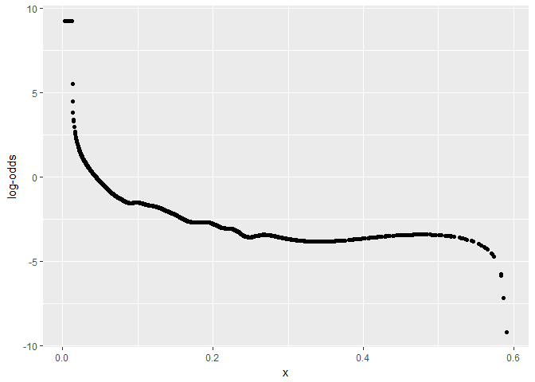

``` r
logit_loess(chances_train$dist, chances_train$goal, span = 0.4)
```

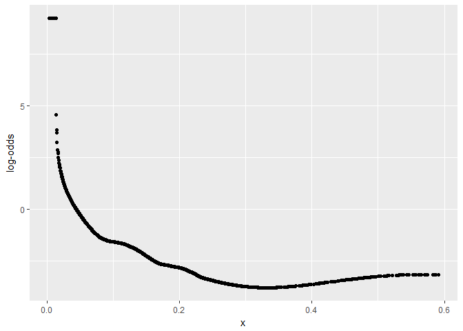

Span of 0.4 seems to be far too large as it is over a half of whole dist range (which is approx. 0.6). Span of 0.1 makes the loess plot quite erratic. So it seems reasonable to go for span 0.2 here as it provides adequate smoothness. The plot is quite linear in the middle, but not in the tails. I think especially left tail is crucial here, as the non-linear trend begins when the observations are still close-ranked. If not linear, what's the relationship then? Here restricted cubic splines comes in help.

We test splines with 3, 4, 5 knots as according to literature these are sufficient in most of cases.

``` r
spline_dist3 <- glm(goal ~ rcs(dist, parms = 3), family = 'binomial', data = chances_train)
spline_dist4 <- glm(goal ~ rcs(dist, parms = 4), family = 'binomial', data = chances_train)
spline_dist5 <- glm(goal ~ rcs(dist, parms = 5), family = 'binomial', data = chances_train)
```

``` r
summary(spline_dist3)$aic
```

    ## [1] 28211.17

``` r
summary(spline_dist4)$aic
```

    ## [1] 28179.45

``` r
summary(spline_dist5)$aic
```

    ## [1] 28072.46

Spline with the lowest AIC is the one with 5 knots.

We'll apply similar procedure to `angle`.

``` r
logit_loess(chances_train$angle, chances_train$goal, span = 0.1)
```

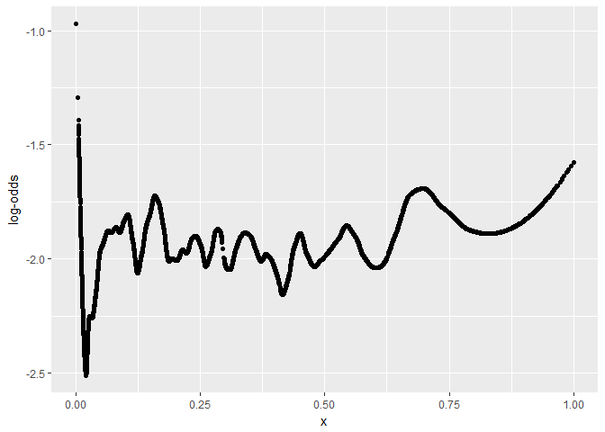

``` r
logit_loess(chances_train$angle, chances_train$goal, span = 0.2)
```

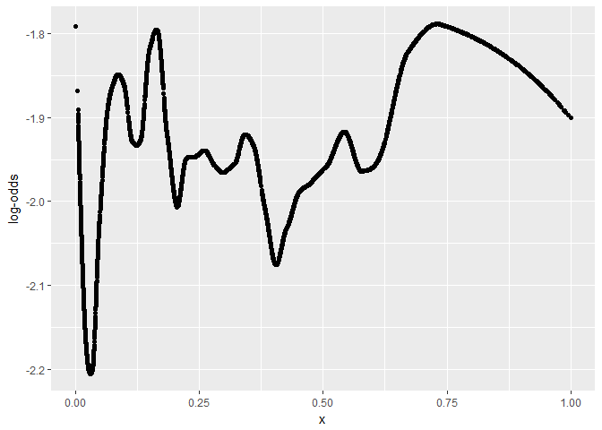

``` r
logit_loess(chances_train$angle, chances_train$goal, span = 0.4)
```

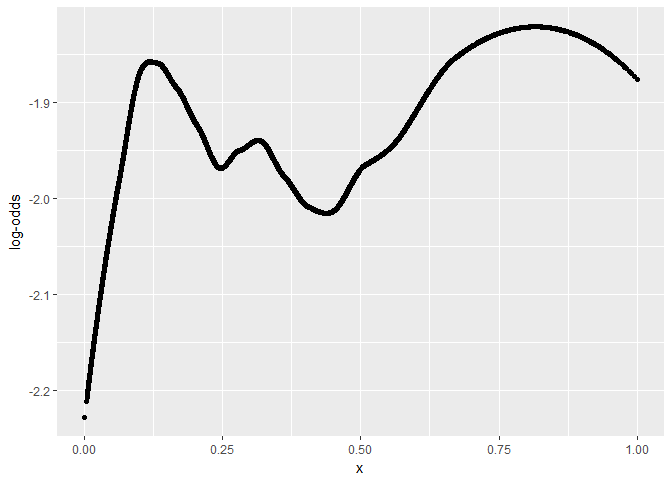

Well, this is quite complex, even with the span of 0.4 so we'll try splines with more knots.

``` r
spline_angle3 <- glm(goal ~ rcs(angle, parms = 3), family = 'binomial', data = chances_train)
spline_angle4 <- glm(goal ~ rcs(angle, parms = 4), family = 'binomial', data = chances_train)
spline_angle5 <- glm(goal ~ rcs(angle, parms = 5), family = 'binomial', data = chances_train)
spline_angle6 <- glm(goal ~ rcs(angle, parms = 6), family = 'binomial', data = chances_train)
spline_angle7 <- glm(goal ~ rcs(angle, parms = 7), family = 'binomial', data = chances_train)
```

``` r
summary(spline_angle3)$aic
```

    ## [1] 32237.25

``` r
summary(spline_angle4)$aic
```

    ## [1] 32225.03

``` r
summary(spline_angle5)$aic
```

    ## [1] 32222.03

``` r
summary(spline_angle6)$aic
```

    ## [1] 32221.75

``` r
summary(spline_angle7)$aic
```

    ## [1] 32222.6

This time we pick the spline with 6 knots as it results in lowest AIC.

So let's replace `dist` and `angle` variables with the fitted splines.

``` r
model4 <- glm(goal ~ shotQuality + defPressure + numDefPlayers + rcs(dist, parms = 5)  + 
                      rcs(angle, parms = 6) + game_state + type_of_attack, 
              family = 'binomial', data = chances_train)
summary(model4)
```

    ## 
    ## Call:
    ## glm(formula = goal ~ shotQuality + defPressure + numDefPlayers + 
    ##     rcs(dist, parms = 5) + rcs(angle, parms = 6) + game_state + 
    ##     type_of_attack, family = "binomial", data = chances_train)
    ## 
    ## Deviance Residuals: 
    ##     Min       1Q   Median       3Q      Max  
    ## -3.2106  -0.2446  -0.0736  -0.0217   4.1455  
    ## 
    ## Coefficients:
    ##                                      Estimate Std. Error z value Pr(>|z|)
    ## (Intercept)                           5.15045    0.31641  16.278  < 2e-16
    ## shotQuality1                         -4.58362    0.27150 -16.882  < 2e-16
    ## shotQuality2                         -2.01974    0.20769  -9.725  < 2e-16
    ## shotQuality3                          0.98699    0.20085   4.914 8.92e-07
    ## shotQuality4                          3.51212    0.20982  16.739  < 2e-16
    ## shotQuality5                          6.93585    0.38726  17.910  < 2e-16
    ## defPressure1                          0.11863    0.07105   1.670 0.094982
    ## defPressure2                          0.01881    0.07223   0.260 0.794555
    ## defPressure3                         -0.12819    0.07284  -1.760 0.078444
    ## defPressure4                         -0.59365    0.08990  -6.604 4.01e-11
    ## defPressure5                         -1.06687    0.21340  -4.999 5.75e-07
    ## numDefPlayers1                       -2.08772    0.19009 -10.983  < 2e-16
    ## numDefPlayers2                       -2.78989    0.19297 -14.458  < 2e-16
    ## numDefPlayers3                       -2.92732    0.19789 -14.792  < 2e-16
    ## numDefPlayers4                       -3.18458    0.21248 -14.988  < 2e-16
    ## numDefPlayers5                       -3.01351    0.24033 -12.539  < 2e-16
    ## numDefPlayers6                       -3.01000    0.28366 -10.611  < 2e-16
    ## numDefPlayers7                       -2.79447    0.31477  -8.878  < 2e-16
    ## numDefPlayers8                       -3.43491    0.47591  -7.218 5.29e-13
    ## numDefPlayers9                       -4.18394    0.95950  -4.361 1.30e-05
    ## numDefPlayers10                      -3.53401    1.37991  -2.561 0.010436
    ## numDefPlayers11                     -14.31285  125.57421  -0.114 0.909254
    ## rcs(dist, parms = 5)dist            -34.86268    1.73996 -20.037  < 2e-16
    ## rcs(dist, parms = 5)dist'            69.34176   13.74337   5.045 4.52e-07
    ## rcs(dist, parms = 5)dist''         -213.60673   46.30158  -4.613 3.96e-06
    ## rcs(dist, parms = 5)dist'''         251.82059   52.06474   4.837 1.32e-06
    ## rcs(angle, parms = 6)angle           -0.25940    1.37480  -0.189 0.850340
    ## rcs(angle, parms = 6)angle'         -17.75623   22.49945  -0.789 0.430004
    ## rcs(angle, parms = 6)angle''         63.74363   60.04688   1.062 0.288433
    ## rcs(angle, parms = 6)angle'''       -96.23226   65.39308  -1.472 0.141130
    ## rcs(angle, parms = 6)angle''''       70.15123   42.78904   1.639 0.101116
    ## game_state                            0.09034    0.06259   1.443 0.148905
    ## type_of_attackOther not assisted     -0.27187    0.07098  -3.830 0.000128
    ## type_of_attackDirect Free-Kick        0.40276    0.18140   2.220 0.026402
    ## type_of_attackHead_Cross High        -1.16968    0.08522 -13.726  < 2e-16
    ## type_of_attackCorner                 -1.02772    0.09995 -10.282  < 2e-16
    ## type_of_attackRebound                 0.52691    0.11398   4.623 3.78e-06
    ## type_of_attackFoot_Cross High        -0.57317    0.11237  -5.101 3.38e-07
    ## type_of_attackFree Kick              -0.71200    0.11648  -6.113 9.81e-10
    ## type_of_attackFoot_Cross Low         -0.21837    0.08171  -2.672 0.007529
    ## type_of_attackOther_Cross Low         0.05096    0.76105   0.067 0.946617
    ## type_of_attackHead_Open Play Pass    -0.71348    0.19435  -3.671 0.000242
    ## type_of_attackOther_Cross High        1.48543    0.59611   2.492 0.012707
    ## type_of_attackHead_Cross Low         -0.64677    0.40877  -1.582 0.113598
    ## type_of_attackOther_Open Play Pass    1.16082    0.72631   1.598 0.109991
    ##                                       
    ## (Intercept)                        ***
    ## shotQuality1                       ***
    ## shotQuality2                       ***
    ## shotQuality3                       ***
    ## shotQuality4                       ***
    ## shotQuality5                       ***
    ## defPressure1                       .  
    ## defPressure2                          
    ## defPressure3                       .  
    ## defPressure4                       ***
    ## defPressure5                       ***
    ## numDefPlayers1                     ***
    ## numDefPlayers2                     ***
    ## numDefPlayers3                     ***
    ## numDefPlayers4                     ***
    ## numDefPlayers5                     ***
    ## numDefPlayers6                     ***
    ## numDefPlayers7                     ***
    ## numDefPlayers8                     ***
    ## numDefPlayers9                     ***
    ## numDefPlayers10                    *  
    ## numDefPlayers11                       
    ## rcs(dist, parms = 5)dist           ***
    ## rcs(dist, parms = 5)dist'          ***
    ## rcs(dist, parms = 5)dist''         ***
    ## rcs(dist, parms = 5)dist'''        ***
    ## rcs(angle, parms = 6)angle            
    ## rcs(angle, parms = 6)angle'           
    ## rcs(angle, parms = 6)angle''          
    ## rcs(angle, parms = 6)angle'''         
    ## rcs(angle, parms = 6)angle''''        
    ## game_state                            
    ## type_of_attackOther not assisted   ***
    ## type_of_attackDirect Free-Kick     *  
    ## type_of_attackHead_Cross High      ***
    ## type_of_attackCorner               ***
    ## type_of_attackRebound              ***
    ## type_of_attackFoot_Cross High      ***
    ## type_of_attackFree Kick            ***
    ## type_of_attackFoot_Cross Low       ** 
    ## type_of_attackOther_Cross Low         
    ## type_of_attackHead_Open Play Pass  ***
    ## type_of_attackOther_Cross High     *  
    ## type_of_attackHead_Cross Low          
    ## type_of_attackOther_Open Play Pass    
    ## ---
    ## Signif. codes:  0 '***' 0.001 '**' 0.01 '*' 0.05 '.' 0.1 ' ' 1
    ## 
    ## (Dispersion parameter for binomial family taken to be 1)
    ## 
    ##     Null deviance: 32235  on 42855  degrees of freedom
    ## Residual deviance: 14598  on 42811  degrees of freedom
    ## AIC: 14688
    ## 
    ## Number of Fisher Scoring iterations: 10

All coefficients associated with angle spline are statistically insignificant. But what if we decide to remove this covariate?

``` r
lrtest(model4a, model4)
```

    ## 
    ## Model 1: goal ~ shotQuality + defPressure + numDefPlayers + rcs(dist, 
    ##     parms = 5) + game_state + type_of_attack
    ## Model 2: goal ~ shotQuality + defPressure + numDefPlayers + rcs(dist, 
    ##     parms = 5) + rcs(angle, parms = 6) + game_state + type_of_attack
    ## 
    ## L.R. Chisq       d.f.          P 
    ##   125.9843     5.0000     0.0000

``` r
(model4a$coefficients - model4$coefficients[names(model4a$coefficients)])/
  model4$coefficients[names(model4a$coefficients)] * 100
```

    ##                        (Intercept)                       shotQuality1 
    ##                        -8.51582900                        -0.44936476 
    ##                       shotQuality2                       shotQuality3 
    ##                        -0.12875654                        -0.80578990 
    ##                       shotQuality4                       shotQuality5 
    ##                        -0.02530642                        -0.20203439 
    ##                       defPressure1                       defPressure2 
    ##                         3.62912340                        52.94285271 
    ##                       defPressure3                       defPressure4 
    ##                        -0.45954160                         1.04468883 
    ##                       defPressure5                     numDefPlayers1 
    ##                         0.76568372                        -5.13077392 
    ##                     numDefPlayers2                     numDefPlayers3 
    ##                        -4.70473612                        -6.43772187 
    ##                     numDefPlayers4                     numDefPlayers5 
    ##                        -6.41218750                        -7.91439190 
    ##                     numDefPlayers6                     numDefPlayers7 
    ##                        -8.51290028                       -10.67933431 
    ##                     numDefPlayers8                     numDefPlayers9 
    ##                       -11.22533334                        -9.83845921 
    ##                    numDefPlayers10                    numDefPlayers11 
    ##                       -12.66985794                        -3.03150921 
    ##           rcs(dist, parms = 5)dist          rcs(dist, parms = 5)dist' 
    ##                        -1.41093273                       -17.34122788 
    ##         rcs(dist, parms = 5)dist''        rcs(dist, parms = 5)dist''' 
    ##                       -24.66820220                       -27.51634424 
    ##                         game_state   type_of_attackOther not assisted 
    ##                         7.88713122                        -0.05861418 
    ##     type_of_attackDirect Free-Kick      type_of_attackHead_Cross High 
    ##                       -26.90444268                        -7.99366599 
    ##               type_of_attackCorner              type_of_attackRebound 
    ##                        -2.58873475                        -2.20640411 
    ##      type_of_attackFoot_Cross High            type_of_attackFree Kick 
    ##                         2.51599646                        -8.79422263 
    ##       type_of_attackFoot_Cross Low      type_of_attackOther_Cross Low 
    ##                       -33.46330068                       236.98542743 
    ##  type_of_attackHead_Open Play Pass     type_of_attackOther_Cross High 
    ##                        -4.11472706                         7.46287679 
    ##       type_of_attackHead_Cross Low type_of_attackOther_Open Play Pass 
    ##                        -2.06761092                         1.03110415

Likelihood ratio test suggests that's clearly not a good idea. Also percentage changes imply that an angle spline provides a needed adjustments to other covariates, so we should probably leave it in a model.

Finally let's test the model performance.

``` r
ROC(form = goal ~ shotQuality + defPressure + numDefPlayers + rcs(dist, parms = 5)  + 
                  rcs(angle, parms = 6) + game_state + type_of_attack, 
    family = 'binomial', data = chances_test, plot = 'ROC')
```

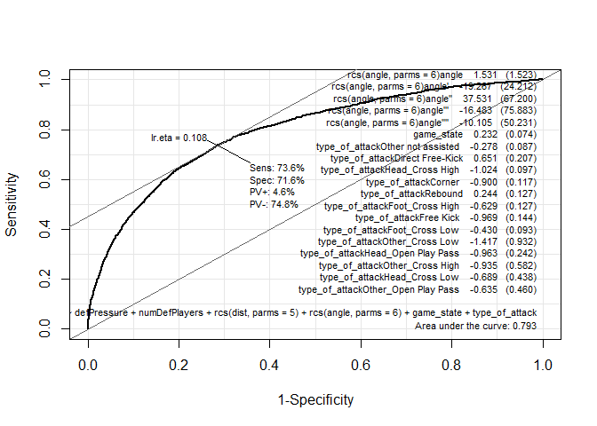

AUC = 95% is really high. I had been quite sceptic at the beginning, so I altered test sets and the AUC didn't change much. Also McFadden ratio with the score of 0.55 is satisfying.

``` r
1 - logLik(model4)/logLik(glm(goal~1, data = chances_train, family = 'binomial'))
```

    ## 'log Lik.' 0.5471289 (df=45)

Although classifying the `goal` variable isn't out objective here, let's make use of it and calculate RMSE.

``` r
chances_test <- chances_test %>% 
  mutate(xG = predict(model4, type = 'response', newdata = chances_test))

rmse <- function(x, y) sqrt(mean((x - y)^2))
rmse_all <- map(1:100, ~ chances_test %>% 
                  transmute(!! paste0("pred", .x) := as.numeric(xG > 0.01 * .x))) %>% 
  bind_cols(.) %>% map_dbl(rmse, y = chances_test$goal)
ggplot() + geom_line(aes(seq(0.01, 1, by = 0.01), rmse_all))
```

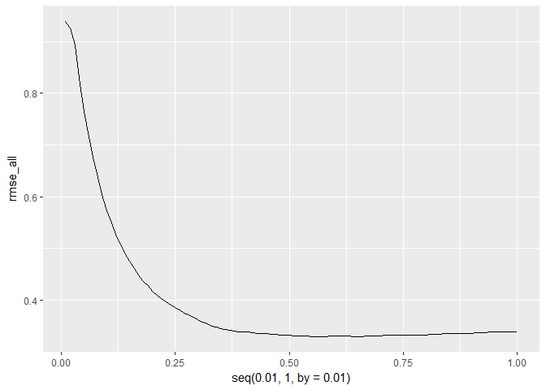

``` r
rmse_all[which.min(rmse_all)]
```

    ##    pred50 
    ## 0.2722226

*pitch\_plot is a slightly modified version of a function shared by @FC\_rstats.*

**This article was written with the aid of StrataData, which is property of [Stratagem Technologies](www.stratagem.co). StrataData powers the [StrataBet Sports Trading Platform](https://app.stratabet.com), in addition to [StrataBet Premium Recommendations](https://stratatips.co).**
